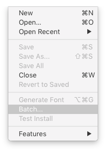
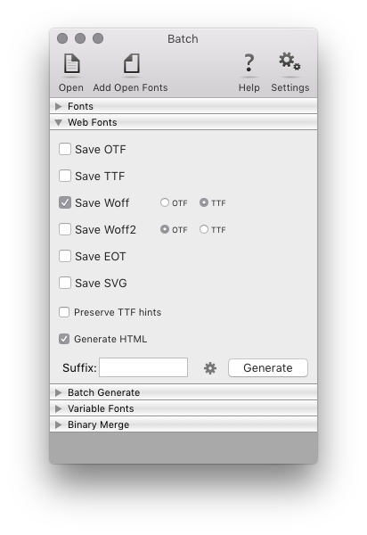
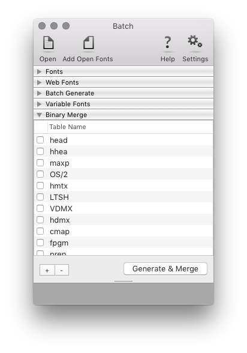
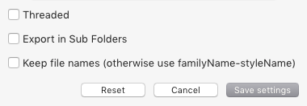

Batch
=====

**Batch is a RoboFont extension to generate binary fonts in batch.**

- supports UFO, OpenType (TTF/CFF) and designSpace files as input
- generates .otf .ttf .pfa .vfb .woff .woff2 .eot .svg & variable fonts

[TOC]

Once installed, Batch will add itself to the *File* menu:

Fonts
-----

Use the *Fonts* section to choose which fonts to use as input.

**Add fonts by dragging files into the list.**

The following types of input files are supported:

- UFO fonts
- OpenType fonts (CFF/TTF)
- UFOs folder
- designSpace file

### Options

add open fonts
:	Use the toolbar button *Add Open Fonts* to include all open fonts to the list.

UFOs folder
:	If a folder is provided, Batch will search for all UFOs inside it.

designSpace files
:	If a designSpace file is provided, it will be expanded into all its masters and instances, and the instances can be generated.

Web fonts
---------

Use the *Web fonts* section to generate webfont formats and related test files.

The following webfont formats are supported:

- .otf
- .ttf
- .woff
- .woff2
- .eot
- .svg

### Options

woff
:	Creates WOFF metadata based on the info in the font, if available.

woff2
:	Does not create any metadata – the fonts are simply compressed.

preserve hints
:	Check this option to prevent autohinting of binary TTF fonts.

suffix
:	Add a suffix to the output file names. The suffix can contain [date time formatting](https://docs.python.org/2/library/time.html#time.strftime).

ttfautohint
:	Opens a sheet to choose ttfautohint settings. 

generate html
:	Generates a HTML preview with some simple presets.

### ttfautohint

TrueType autohinting with [ttfautohint] is available when generating OpenType-TrueType webfonts.

Click on the gears icon to open the ttfautohint settings.

See the [ttfautohint documentation] for details about each setting.

[ttfautohint]: http://www.freetype.org/ttfautohint/
[ttfautohint documentation]: https://www.freetype.org/ttfautohint/doc/ttfautohint.html

### Generate HTML

If *Generate HTML*  is selected, Batch will generate a simple HTML+CSS test page to preview the webfonts.

Use the top text area to edit the HTML code, and the bottom one to edit the CSS.

The HTML preview can replace `%(familyName)s` and `%(styleName)s` by the corresponding font info values retrieved from the font.

Batch generate
--------------

Use the *Batch Generate* section to generate desktop fonts, and to convert fonts to VFB format.

The following binary output formats are supported:

- .otf
- .ttf
- .pfa
- .vfb
- variable fonts

*Note: Generating .vfb fonts requires [ufo2vfb].*

[ufo2vfb]: http://blog.fontlab.com/font-utility/vfb2ufo/

### Options

* decompose
* remove overlap
* autohint
* release mode

suffix
:	Add a suffix to the output file names. The suffix can contain [date time formatting](https://docs.python.org/2/library/time.html#time.strftime).

Variable Fonts
--------------

Use the *Batch Generate* section to generate variable fonts. 

*Note: It is required to provide a designSpace file.*

Batch will try to optimize the designSpace data by performing the following actions:

* Add off-curve points where needed to make contours compatible.
* Add axes to the design space if they are missing.
* Add missing glyphs by generating them from the design space.
* Add kerning pairs to make kerning compatible.

### Options

autohint
:	...

interpolate to fit axes extremes
:	...

Binary Merge 
------------

Use the *Binary Merge* section to merge specific tables from a source.

**This option is available only when a UFO is provided, and when the UFO has the source path in the `font.lib`.**

Binary Merge will use the output settings selected in the *Batch Generate* section.

Settings
--------

Click on the gears icon in the toolbar to open the *Settings* sheet.

threaded
:	...

export in subfolders
:	Create subfolders for different types of file.

keep file names
:	Use the same file names as the input fonts.
