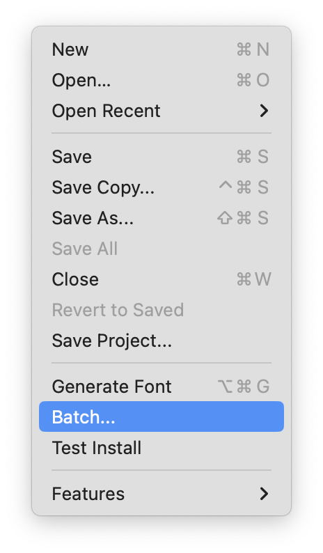
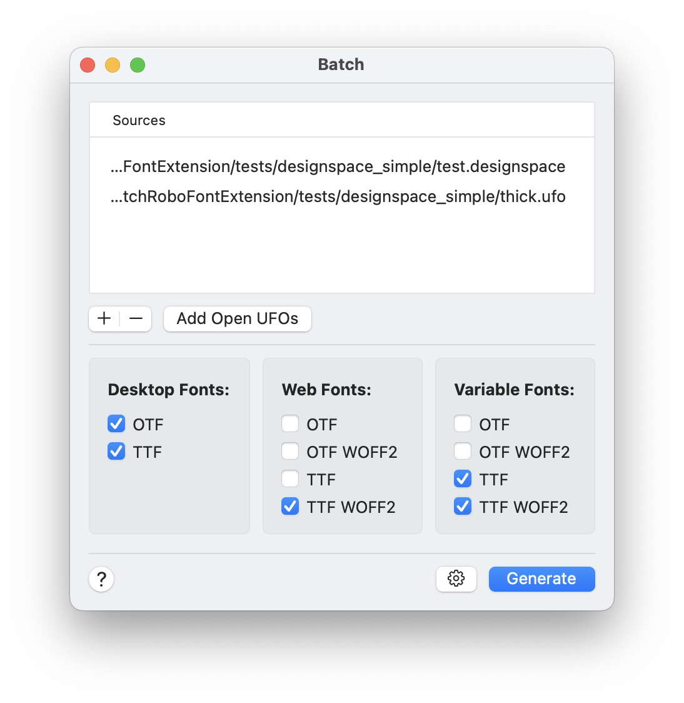

# Batch

**Batch is a RoboFont extension to generate binary fonts in batch.**

- supports UFO, OpenType (TTF/CFF) and designSpace files as input
- generates .otf .ttf .pfa .woff2 & variable fonts

## Documentation

- [Sources](#sources)
- [Desktop Fonts](#desktop-fonts)
- [Web fonts](#web-fonts)
- [Variable fonts](#variable-fonts)
- [Settings](#settings)

Once installed, Batch will add itself to the *File* menu:

# Sources

Use the *Sources* section to choose which fonts to use as input.

**Add fonts by dragging files into the list or use the + - buttons.**

The following types of input files are supported:

- UFO fonts
- OpenType fonts (CFF/TTF)
- UFO's folder
- designspace file

If a designspace file is provided, it will be expanded into all it's sources and instances, the instances can be generated as seperate static desktop and web fonts.

# Export formats

## Desktop Fonts

- .otf
- .ttf

## Web Fonts

- .otf
- .otf (woff2)
- .ttf
- .ttf (woff2)

## Variable Fonts

- .otf
- .otf (woff2)
- .ttf
- .ttf (woff2)

*Note: It is required to provide a designSpace file.*

Batch will try to optimize the designspace data by performing the following actions:

* Add off-curve points where needed to make contours compatible.
* Add axes to the design space if they are missing.
* Add missing glyphs by generating them from the design space.
* Add kerning pairs to make kerning compatible.

Settings
--------

Click on the gears icon in the toolbar to open the *Settings* sheet.

## Desktop Fonts

### Generate

- **Decompose**
- **Remove Overlap**
- **Autohint**
- **Release Mode**

### Suffix

A suffix added to to the export path.

## Web Fonts

### Generate

- **Decompose**
- **Remove Overlap**
- **Autohint**
- **Release Mode**
- **Generate HTML** build a test html page with the Batch generated fonts.

### Suffix

A suffix added to to the export path.

### TTF Autohint

see the documentation of [ttf autohint](https://freetype.org/ttfautohint/doc/ttfautohint.html)

## Variable Fonts

### Generate

- **Interpolate to Fit Axis Extremes** generate missing extremes for all axis.
- **Autohint**

### Suffix

A suffix added to to the export path

## Batch Settings

- **Export in sub-folders**
- **Use familyName-styleName** or **Keep file names**
- **Store Export Report**
- **Debug**

